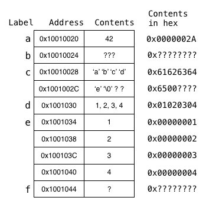

## Registers vs Memory

C doesn't touch registers.

Last week, you didn't touch memory.

What's the difference?

## Words

A word is a fixed-sized piece of data handled by the instruction set.

MIPS is a 32-bit architecture, meaning instructions and 
registers are all 32 bits long.

In MIPS, a word is 32 bits or 4 bytes long.

## Load / Store Architecture

MIPS is a load / store architecture.

Instructions can only do:
- memory access (load or store)
- logic and arithmetic operations

To get something from memory, use:
- lw == load word # 32 bits == 4 bytes

To put something into memory, use:
- sw == store word # 32 bits == 4 bytes

## Question 3

If the data segment of a particular MIPS program starts at the address 0x10000020, then what addresses are the following labels associated with, and what value is stored in each 4-byte memory cell? 

    .data
a:  .word   42
sizeof == 4 bytes
addr == 0x10000020
type == int

b:  .space  4
sizeof == 4 bytes
addr == 0x10000020 + 4 == 0x10000024
type == ???

c:  .asciiz "abcde" 6 -> 8
    .align  2
    # pads memory to nearest address divisible by 2^2 == 4
    # address must be divisible by size of type
sizeof == 8
addr == 0x10000024 + 4 == 0x10000028
type = char[]

d:  .byte   1, 2, 3, 4 # byte == char
sizeof == sizeof(char) * 4 == 1 * 4 == 4
addr == 0x10000028 + 8 = 0x1000002C + 4 = 0x10000030
type == char[]

e:  .word   1, 2, 3, 4 # word == int
sizeof == sizeof (int) * 4 == 4 * 4 == 16
addr == 0x10000030 + 4 == 0x10000034
type == int[]

f:  .space  1
sizeof == 1
addr = 0x10000034 + 16 == 0x10000044
type = ???

## Answer

