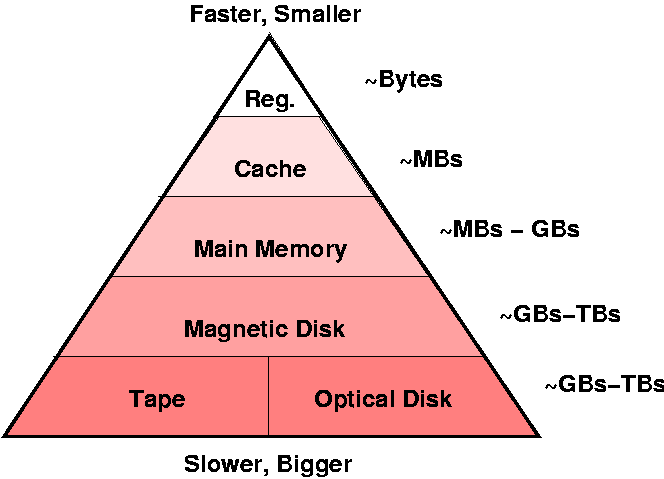

## Registers vs Memory

C doesn't touch registers.

Last week, you didn't touch memory.

What's the difference?

## Words

A word is a fixed-sized piece of data handled by the instruction set.

MIPS is a 32-bit architecture, meaning instructions and 
registers are all 32 bits long.

In MIPS, a word is 32 bits or 4 bytes long.

## Load / Store Architecture

MIPS is a load / store architecture.

Instructions can only do:
- memory access (load or store)
- logic and arithmetic operations

To get something from memory, use:
- lw == load word # 32 bits / 4 bytes

To put something into memory, use:
- sw == store word

## Question 3

If the data segment of a particular MIPS program starts at the address 0x10000020, then what addresses are the following labels associated with, and what value is stored in each 4-byte memory cell? 

    .data
a:  .word   42
sizeof == 4 bytes
addr == 0x10000020

b:  .space  4 # how many bytes you want
sizeof == 4 bytes
addr == 0x10000024

c:  .asciiz "abcde" 6 -> 8
    .align  2 # make sure it's aligned to 2^2 == 4, otherwise byte alignment error
sizeof == 8
addr == 0x10000028

| 8 bytes | word |

d:  .byte   1, 2, 3, 4 # byte == char
sizeof == 4 == 4 * sizeof(char)
addr == 0x10000030 # 28 + 4 = 2C + 4 = 30
what type variable of variable is this? char[]

e:  .word   1, 2, 3, 4 # word == int
sizeof == 16 == 4 * sizeof(int) == 4 * 4
addr == 0x10000030 + 4 ==  0x10000034
what type variable of variable is this? int[]

f:  .space  1
sizeof == 1
addr = 0x10000034 + 16 == 0x10000044
type of variable = ???

## Answer

